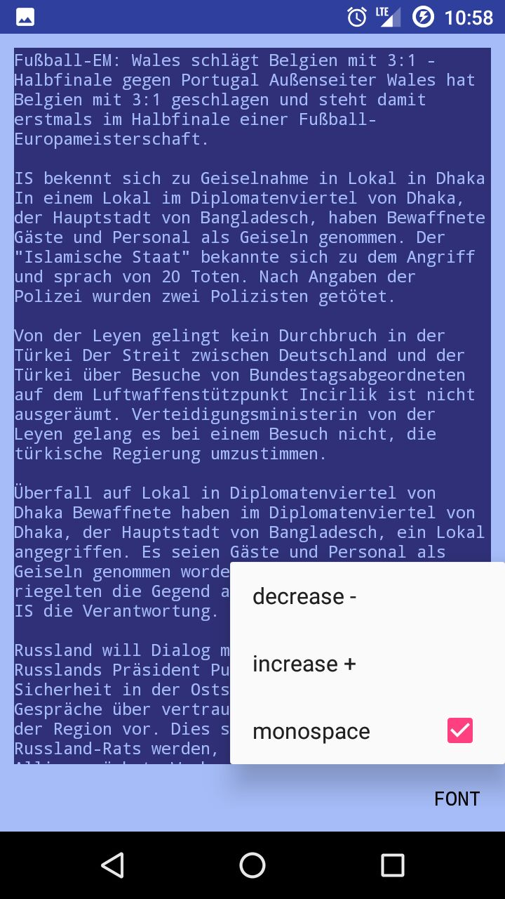

# TextThing
TextThing is a simple text file editor for Android. You can use it via a file manager app. I use it to write some notes. The fixed default file path is `Documents/click.dummer.textthing/notes.txt`

