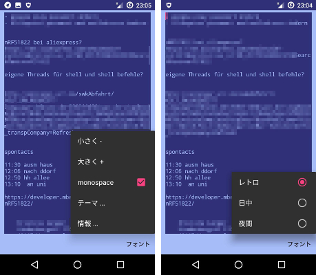

# Retro Text Editor

It is a simple text file editor for Android. You can use it via a file manager app. I use it to write some notes. The fixed default file path is `Documents/click.dummer.textthing/notes.txt` . If you open the app, this file will be opened, created and used for store.

**There is no file manager integrated!**

You can get a signed APK from here (Android 4.1+): [APK](https://github.com/no-go/TextThing/raw/master/app/release/click.dummer.textthing.apk)

## App Icon

## Features

- Themes: Retro, Day, Night
- Text file editor for your favorite file manager (opens every plain Text files)
- App creates and opens Documents/click.dummer.textthing/notes.txt as default
- use the App to write notes
- stores changes on closing or pausing the App (optionaly)
- set your favorite font size and switch between normal or monospace style
- languages: english, japanese, german, russian, french
- a **save now** button
- very small widget added (needs phone restart)

## Screenshots

The blue colors are fixed and based on the 1980er C64 Homecomputer. It works on 4.1.1+

 

### French translation

Thanks to [xin](https://github.com/xinxinxinxinxin) for a french translation!

### Russian translation

Thanks to [Alexey](https://github.com/alexxxdev) for a russian translation!

### Japanese translation

Thanks to [naofum](https://github.com/naofum) for a japanese translation!

## Links

- [About Me](http://quantenwatch.de), [Jochen Peters Krefeld](http://dummer.click)
- [App Home](http://no-go.github.io/TextThing/)
- [Source](https://github.com/no-go/TextThing)
- [APK File](https://raw.githubusercontent.com/no-go/TextThing/master/app/release/app-release.apk)

## License

I publish everything under the free BSD-2 License.

## Privacy Policy

### Personal information.

Personal information is data that can be used to uniquely identify or contact a single person. I DO NOT collect, transmit, store or use any personal information while you use this app.

### Non-Personal information.

I DO NOT collect non-personal information like user's behavior:

 -  to solve App problems
 -  to show personalized ads

The google play store collect non-personal information such as the data of install (country and equipment).

### Privacy Questions.

If you have any questions or concerns about my Privacy Policy or data processing, please contact me.

## Special thanks

- Michael Grieswald on google play for a good/bad review. I made the "auto save" as an option after reading it.
