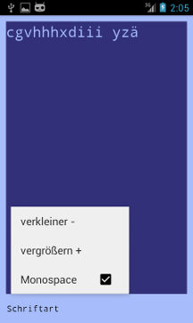

# TextThing
TextThing is a simple text file editor for Android. You can use it via a file manager app. I use it to write some notes. The fixed default file path is `Documents/click.dummer.textthing/notes.txt` . If you open the app, this file will be opened, created and used for store. There is no file manager integrated!

## App Icon

## Screenshots
The blue colors are fixed and based on the 1980er C64 Homecomputer. TextThing / TextDing works on 4.1.1+

 

## License

I publish everything under the free BSD-2 License.
